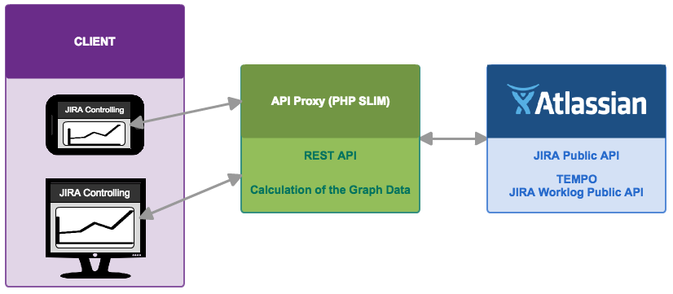

# JIRA Worklog Controlling

Our app helps the project owner to control the worklog of their JIRA projects.

We store in our backend service all project relevant informations and configurations.
The layout is ready for desktop and tablet devices. Worklogs will be presentet with
charts and tables.

#Project
##Big Picture


##API's
- [JIRA API](https://docs.atlassian.com/jira/REST/latest/#api/2/)
- [TEMPO API](http://tempo.io/doc/timesheets/api/rest/latest/#1279953671)

##Team
- Gabriel Brunner ([Brunn3r](https://github.com/Brunn3r))
- David Heimgartner ([davidheimgartner](https://github.com/davidheimgartner))
- Gerhard Hirschfeld ([hirsch88](https://github.com/hirsch88))

##Mockups
[Mockups](./mockups.pdf)

##Non Functional Requirements
| ID            | Name          |
| :------------ |:--------------|
| NFR_001       | Application must work on desktop and tablet devices |
| NFR_002       | Response time of our backend must be under 6sec |
| NFR_003       | The app should be responsive(FlexBox) |
| NFR_004       | The app should be build with the MVC standard |

#Development
##Libraries

- [JQuery](http://jquery.org)
  - JQuery is used for the DOM manipulations.
- [RequireJS](http://requirejs.org/)
  - RequireJS is a simple module loader lib. We use this to provide the MVC pattern.
- [Handlebars](http://handlebarsjs.com/)
  - Handlebars build semantic templates. We use this to render our views.
- [Semantic UI](http://semantic-ui.com/)
  - Semantic UI is a HTML5 Framework, which provides us the basic skeleton for our app.
- [Font Awesome](http://fontawesome.io/)
  - Font Awesome is huge icon library

 ## Our Proxy API
Our API was developed with the Framework Slim. [Documentation](https://github.com/fhnw-students/fhnw-webec-controlling-backend)

#Get Started

- First install [NodeJS](https://nodejs.org/en/)
- Then open a terminal and naviagte to your project folder
- Run ```npm install``` to install all dependencies
- To start a local web-server you can run ```http-server```
